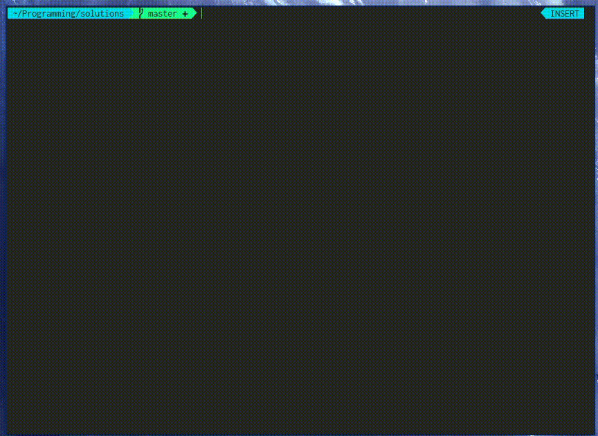
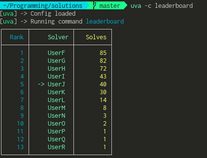

# UVa-Manager

UVa-Manager is a tool for downloading problems from onlinejudge.org, testing solutions, comparing solution counts and various other managing needs.

## Showcase 

### Workflow

In this gif I create the problem directory, download the pdf and create test cases with `uva init 10278`.
Then I open the problem file with `uva open fi`, where `fi` is a string in the problem name `10278-Fire-station`, if
I had written `uva open fire` instead, it wouldn't have asked me to choose a problem. It opens your solution for a problem (like in this case), or if there is none it will open a new file for that solution.
Then I enter the problem directory with the `z` alias in `zsh`. Now I can test my solution with `uva test 10278.cpp`, it will use the test cases created by `uva init`. Since both my test cases match with the correct output I submit the problem with `uva submit 10278.cpp`. It then makes a http post request to `onlinejudge.org` and then checks whether the solution has been accepted.

### Leaderboard

## Running UVa-Manager

`uva` expects a **command** as the first argument. Any argument after that will be supplied to that **command**. **Flags** can be added anywhere, these will be filtered before running the commands.

### Available **flags**:

* `-h`, `--help` - prints help page (will print in color if `-c` supplied before this flag)
* `-c`, `--color` - enables color for all input, uses ANSI escape codes for colors (highly recommended)
* `-s`, `--silent` - silent or quiet mode, does not print unnecessary logs

### Available **commands**:

**Note** that each of these can be shortened to the first letter of the command, i.e. you can use `uva f` instead `uva find`.

* `uva init <problem-number>` - initializes problem: downloads pdf, creates folder, extracts test cases from pdf and uDebug
* `uva test <problem-file>` - tests problem on "t1out.txt"-like test cases found in `12345-Problem_dir/test-cases/`
* `uva debug <problem-file>` **[not implemented yet]** - same as `uva test`, but also tests on uDebug test cases
* `uva leaderboard` - shows solve stats for all problems
* `uva pdf <string>` - opens pdf for problem (uses `uva find` to find matching name) (uses `xdg-open`)
* `uva questtosolve <problem-number>` **[not implemented yet]** - shows questtosolve solution hints for the problem
* `uva find <string>` - looks for `<string>` in any folder or file name in the solutions folder
* `uva open <string>` - opens your solution for a problem (uses `uva find` to find matching name)
* `uva submit <problem-file>` - submits problem to onlinejudge.org (`config.sh` needs to have your username and password)
* `uva validate` **[not implemented yet]** - prints all inaccuracies in the solutions folder which don't correspond to the guidelines

`<arg>` - required argument

`[arg]` - optional argument

## Installation

### Automatic install

Run `setup.sh`

You might need to install some dependencies manually though (look below). WIP

### Manual install

To install just clone the repository, now you can need to set up the `config.sh`. There is an example config in `config.sh.example`, rename it and change the variables. Your uva username and password are only needed if you want to submit problems with `uva submit`.

To use `uva` instead of the entire path to the script you can:

* `alias uva=/path/to/uva/script/file` in your shell config (add `-c` if you always want colors)
* `ln /path/to/uva/script/file ~/.local/bin/` if `~/.local/bin` is in your PATH.

You may need to add executable permissions to the script[s]: `chmod +x /path/to/script`

### Dependencies

#### Usually preinstalled on most distros:
* `bash`
* `python3`
* `pdftotext` 
* `curl`

#### Usually not preinstalled on most distros:
* `lxml` -> `pip3 install lxml --user`
* `colordiff`
